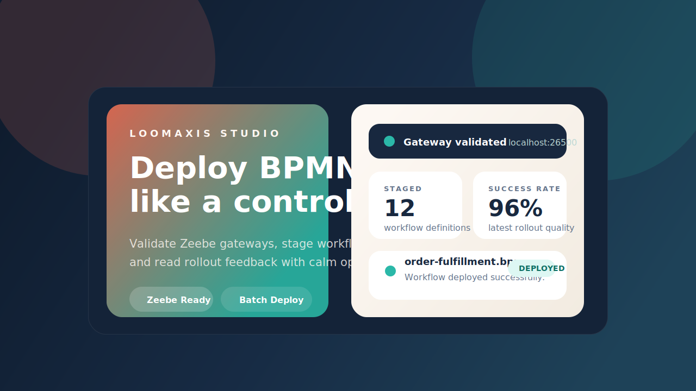

# Loomaxis Studio



Loomaxis Studio is a polished BPMN deployment console for Zeebe teams. It turns a basic upload form into a command-deck style product with gateway validation, batch BPMN staging, and readable deployment feedback for every workflow in the rollout.

The current product direction uses `Loomaxis Studio` as a working brand name. It is intentionally neutral and product-ready, but you should still do a proper trademark and domain check before registering it publicly.

## Why This Repo Feels Different

- A custom premium UI instead of a stock admin panel.
- Stronger backend validation with cleaner deployment summaries.
- Honest handling of auth profiles: the UI captures them, while the backend clearly signals that credential passthrough still needs a deeper Zeebe auth adapter.
- Built-in sample workflow so anyone can demo the product fast.
- CI coverage for frontend build and backend tests.

## Product Surface

- Gateway validation with host:port checks, TCP reachability, and topology probing.
- BPMN staging for files, folders, and drag-and-drop batches.
- A deployment feed that highlights success, validation issues, and backend notes.
- A bundled sample workflow at [`frontend/public/samples/order-fulfillment.bpmn`](./frontend/public/samples/order-fulfillment.bpmn).
- Dockerized frontend and backend for quick local spin-up.

## Stack

- Frontend: React + Vite + custom CSS
- Backend: FastAPI + pyzeebe
- Infra: Docker Compose, Nginx, GitHub Actions

## Quick Start

### Docker Compose

```bash
docker compose up --build
```

Open:

- Frontend: [http://localhost:3000](http://localhost:3000)
- Backend: [http://localhost:8000](http://localhost:8000)

### Run Locally

Frontend:

```bash
cd frontend
npm install
cp .env.example .env
npm run dev
```

Backend:

```bash
cd backend
python3 -m venv .venv
. .venv/bin/activate
pip install -r requirements.txt -r requirements-dev.txt
uvicorn main:app --reload
```

## Repo Layout

```text
.
├── backend/                  FastAPI service for gateway testing and BPMN deployment
├── frontend/                 Loomaxis Studio UI
├── docs/                     Repo-facing visual assets
├── .github/workflows/ci.yml  Build and test automation
├── docker-compose.yml        Full stack local startup
└── test-process.bpmn         Original sample BPMN file from the starter project
```

## Backend Note

`basic` and `oauth` are handled as UI-level connection profiles today. The backend returns explicit warnings for them because secure credential passthrough still needs a dedicated Zeebe channel implementation. That keeps the current product honest while preserving the shape needed for a future secure transport layer.

## Validation

- `npm run build` in [`frontend`](./frontend)
- `pytest` in [`backend`](./backend)

## License

[MIT](./LICENSE)
